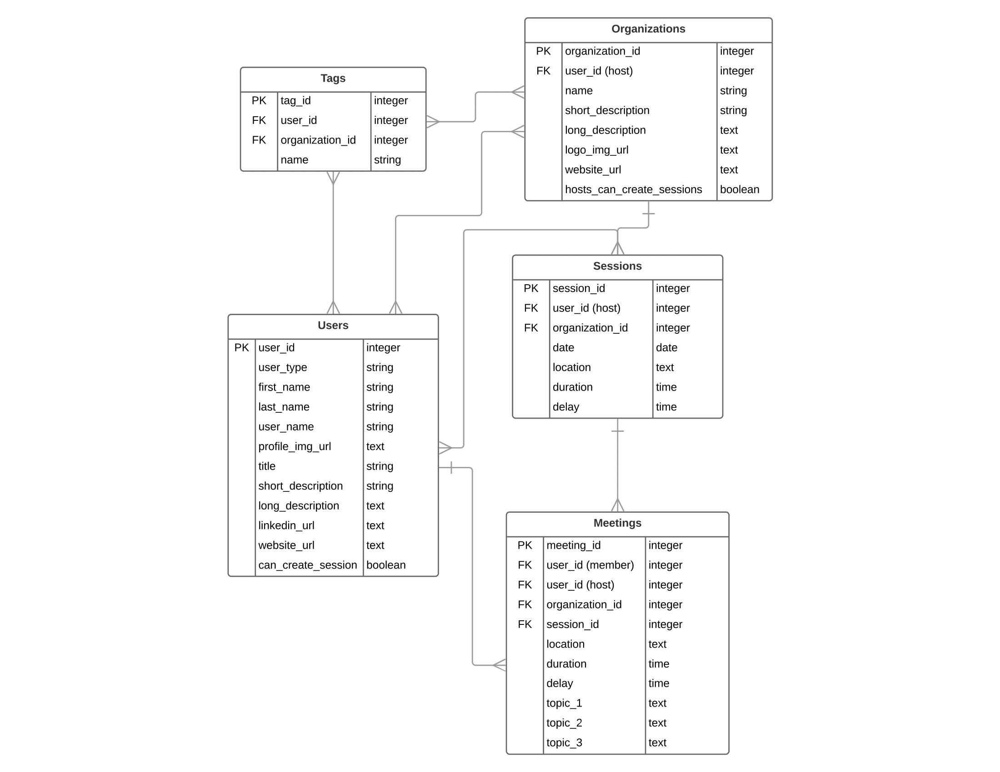

# OfficeHours-server

## Database Structure



## Setup
1. Fork and clone this repository
1. `createdb officehours`
1. `npm run setup`

## Routes

### ----- UserRoutes --------------------------------------------------------------------------

**GET /api/users**
- Get all users

**GET /api/users/:id**
- Get a user by ID

**POST /api/users/register**
- Create a new user
    - required fields in req.body:
```
{
    user_type,              // STRING
    first_name,             // STRING
    last_name,              // STRING
    user_name,              // STRING
    profile_img_url,        // STRING
    title,                  // STRING
    short_description,      // STRING
    long_description,       // STRING
    linkedin_url,           // STRING
    website_url,            // STRING
    can_create_session      // BOOLEAN
}
```

**POST /api/users/login**
- Login existing user
    - required fields in req.body:
```
{
    user_name,              // STRING
    password,               // STRING
}
```

**PATCH /api/users/:id**
- Update current user info
    - at least one(1) of the following fields in body is required:
```
{
    user_type,              // STRING
    first_name,             // STRING
    last_name,              // STRING
    user_name,              // STRING
    profile_img_url,        // STRING
    title,                  // STRING
    short_description,      // STRING
    long_description,       // STRING
    linkedin_url,           // STRING
    website_url,            // STRING
    can_create_session      // BOOLEAN
}
```

**DELETE /api/users/:id**
- Delete a user by ID


### ----- OrganizationsRoutes --------------------------------------------------------------------------

**GET /api/organizations**
- Get all organizations

**GET /api/organizations/:oid**
- Get an organization via ID

**POST /api/organizations**
- Create an organization

**PATCH /api/organizations/:oid**
- Update an organization's info

**DELETE /api/organizations/:oid**
- Delete an organization via ID


### ----- SessionsRoutes --------------------------------------------------------------------------

**GET /api/organizations/:oid/sessions**
- Get all sessions

**GET /api/organizations/:oid/sessions/:sid**
- Get a session via ID

**POST /api/organizations/:oid/sessions**
- Create a session

**PATCH /api/organizations/:oid/sessions/:sid**
- Update a session's info

**DELETE /api/organizations/:oid/sessions/:sid**
- Delete a session via ID 


### ----- MeetingsRoutes --------------------------------------------------------------------------

**GET /api/organizations/:oid/sessions/:sid/meetings**
- Get all meetings

**GET /api/organizations/:oid/sessions/:sid/meetings/:mid**
- Get an meetings via ID

**POST /api/organizations/:oid/sessions/:sid/meetings**
- Create a meeting

**PATCH /api/organizations/:oid/sessions/:sid/meetings/:mid**
- Update a meeting's info

**DELETE /api/organizations/:oid/sessions/:sid/meetings/:mid**
- Delete a meeting via ID
