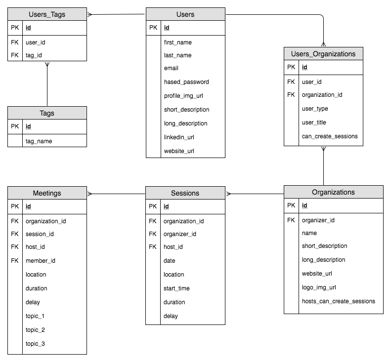

# OfficeHours-server

## Database Structure



## Setup
1. Fork and clone this repository
1. `createdb officehours`
1. `npm run setup`

## Routes

### ----- UserRoutes --------------------------------------------------------------------------

**GET /api/users**
- Get all users

**GET /api/users/:id**
- Get a user via ID

**POST /api/users/register**
- Create a new user
    - fields in req.body:
```
{
    // REQUIRED 
    first_name,             // STRING
    last_name,              // STRING
    email,                  // STRING
    password,               // STRING

    // NOT REQUIRED
    profile_img_url,        // STRING
    short_description,      // STRING
    long_description,       // STRING
    linkedin_url,           // STRING
    website_url,            // STRING
}
```

**POST /api/users/login**
- Login existing user
    - required fields in req.body:
```
{
    email,                  // STRING
    password,               // STRING
}
```

**PATCH /api/users/:id**
- Update user info via ID
    - at least one(1) of the following fields in body is required:
```
{
    first_name,             // STRING
    last_name,              // STRING
    email,                  // STRING
    password,               // STRING
    profile_img_url,        // STRING
    short_description,      // STRING
    long_description,       // STRING
    linkedin_url,           // STRING
    website_url,            // STRING
}
```

**DELETE /api/users/:id**
- Delete a user by ID


### ----- OrganizationsRoutes --------------------------------------------------------------------------

**GET /api/organizations**
- Get all organizations

**GET /api/organizations/:id**
- Get an organization via ID

**POST /api/organizations**
- Create an organization
    - required fields in req.body:
```
{
    organizer_id,               // INTEGER
    name,                       // STRING
    short_description,          // STRING
    long_description,           // STRING
    logo_img_url,               // STRING
    website_url,                // STRING
    hosts_can_create_sessions   // BOOLEAN
}
```

**PATCH /api/organizations/:id**
- Update an organization's info via ID
    - at least one(1) of the following fields in body is required:
```
{
    organizer_id,               // INTEGER
    name,                       // STRING
    short_description,          // STRING
    long_description,           // STRING
    logo_img_url,               // STRING
    website_url,                // STRING
    hosts_can_create_sessions   // BOOLEAN
}
```

**DELETE /api/organizations/:id**
- Delete an organization via ID


### ----- OrganizationsUsersRoutes ---------------------------------------------------------------------

**GET /api/organizations/:id/users**
- Get all organization's users

**GET /api/organizations/:id/users**
- Get an organization's user via ID

**POST /api/organizations/:id/users**
- Create a user for an organization
    - required 
```
{
    user_id,                // INTEGER
    organization_id,        // INTEGER
    user_type,              // STRING
    user_title,             // STRING
    can_create_sessions     // BOOLEAN
}
```

**PATCH /api/organizations/:id/users/:uid**
- Update a user for an organization
    - at least one(1) of the following fields in body is required:
```
{
    user_id,                // INTEGER
    organization_id,        // INTEGER
    user_type,              // STRING
    user_title,             // STRING
    can_create_sessions     // BOOLEAN
}
```

**DELETE /api/organizations/:id/users/:uid**
- Delete an organization's user via ID


### ----- SessionsRoutes --------------------------------------------------------------------------

**GET /api/organizations/:id/sessions**
- Get all sessions

**GET /api/organizations/:id/sessions/:sid**
- Get a session via ID

**POST /api/organizations/:id/sessions**
- Create a session
    - required fields in req.body:
```
{
    user_id,            // INTEGER
    organization_id,    // INTEGER
    date,               // STRING
    start_time,         // STRING
    location,           // STRING
    duration,           // STRING
    delay               // STRING
}
```

**PATCH /api/organizations/:id/sessions/:sid**
- Update a session's info
    - at least one(1) of the following fields in body is required:
```
{
    user_id,            // INTEGER
    organization_id,    // INTEGER
    date,               // STRING
    start_time,         // STRING
    location,           // STRING
    duration,           // STRING
    delay               // STRING
}
```

**DELETE /api/organizations/:id/sessions/:sid**
- Delete a session via ID 


### ----- SessionsHostsRoutes ---------------------------------------------------------------------

**GET /api/organizations/:id/sessions/:sid/host**
- Get a session's host

**POST /api/organizations/:id/sessions/:sid/host**
- Assign a host to a session
    - required fields in req.body:
```
{
    host_id,        // INTEGER
}
```

**DELETE /api/organizations/:id/sessions/:sid/hosts/:hid**
- Remove host from a session via ID 


### ----- MeetingsRoutes --------------------------------------------------------------------------

**GET /api/organizations/:id/sessions/:sid/meetings**
- Get all meetings

**GET /api/organizations/:id/sessions/:sid/meetings/:mid**
- Get an meetings via ID

**POST /api/organizations/:id/sessions/:sid/meetings**
- Create a meeting
    - required fields in req.body:
```
{

}
```

**PATCH /api/organizations/:id/sessions/:sid/meetings/:mid**
- Update a meeting's info
    - at least one(1) of the following fields in body is required:
```
{
    
}
```

**DELETE /api/organizations/:id/sessions/:sid/meetings/:mid**
- Delete a meeting via ID


### ----- MeetingsMemberRoutes --------------------------------------------------------------------

**GET /api/organizations/:id/sessions/:sid/meetings/:mid/members**
- Get a meeting's members

**POST /api/organizations/:id/sessions/:sid/meetings/:mid/members**
- Assign a meetings/:mid/members to a session
    - required fields in req.body:
```
{
    member_id,      // INTEGER
}
```

**DELETE /api/organizations/:id/sessions/:sid/meetings/:mid/members/:memid**
- Remove member from a meeting via ID 